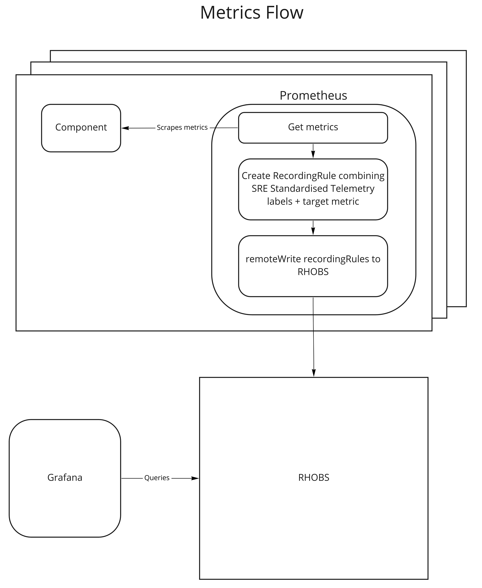

# Centralising Metrics and Dashboards

## Introduction
SREP will use a centralised RHOBS (Red Hat Observability Service) to send metrics to for the purpose of tracking and deep diving SLOs as well as feature adoption. 

To ensure dashboarding and querying is reliable, requirements of metrics from the querying perspective must be accounted for within clusters sending to the centralised service. 

## Requirements

There are 5 main contexts that need to be available and each requires a specific label to ensure that context exists in a centralised service.

| Context | Required Label | 
|---------|----------------|
| Fleet | `_id=~".+"`|
| Provider | `provider=""`|
| Region | `region=""`|
| Version | `version=""`|
| Cluster | `_id="CLUSTER_UUID"`|


These contexts (labels) are now represented via [standardised telemetry](https://github.com/openshift/managed-cluster-config/blob/master/deploy/sre-prometheus/centralized-observability/100-sre-telemetry-managed-labels-recording-rules.PrometheusRule.yaml). 

Example

```
(⎈ api-dofinn-20220718-lnsy-s1-devshift-org:6443:default) oc -n openshift-monitoring exec prometheus-k8s-0 -- promtool query instant http://127.0.0.1:9090 'sre:telemetry:managed_labels'
sre:telemetry:managed_labels{_id="81b16ce8-01da-4832-9303-cc0e8a1cc0aa", provider="AWS", region="ap-southeast-2", sre="true", version="4.10.21"} => 1 @[1658115941.085]
```

Additionally, sending needless labels like `pod` and `instance` for our goals increases cardinality and reduces reliability of dashboards and queries. 

## Hows it work?

1. `sre:telemetry:managed_labels` is deployed in the clusters as a recording rule
2. Each metric that needs to be sent to RHOBS via remoteWrite should be combined with the `sre:telemetry:managed_labels`. The goal being to extract the interesting labels of the metric and combine with the standardised labels. An example of this for the `probe_success` metric generated by [RMO](https://github.com/openshift/route-monitor-operator) can be found [here](https://github.com/openshift/managed-cluster-config/pull/1218/files). 
3. Now these new recording rules can be configured to be sent to RHOBS via [remoteWrite](https://github.com/openshift/managed-cluster-config/blob/master/deploy/cluster-monitoring-config/cluster-monitoring-config.yaml#L13).
```
      remoteWrite:
        - url: http://token-refresher.openshift-monitoring.svc.cluster.local
          remoteTimeout: 30s
          writeRelabelConfigs:
          - sourceLabels: [__name__]
            action: keep
            regex: '(other_metrics|sre:slo:probe_success_api|sre:slo:probe_success_console)'
```
4. Dashboards can now query these recording rules and utilize the available standardised labels to achieve the required context. 
5. Dashboards can now utilise standardised drill down per the labels. 
6. Additionally, RHOBS also supports recording rules... So we could create a recording rule for the `sre:slo:probe_success_api` over 28 days and have the dashboard query that, rather than calculate the 28 days upon request. 

## Where are the dashboards? How do I create one? 

The dashboards can be found in OSD folder of the APP-SRE managed Grafana. There is both [stage](https://grafana.stage.devshift.net/d/LZREaH6nk/osd-mission-control?orgId=1&search=open&folder=current) and [production](https://grafana.app-sre.devshift.net/d/f96TLH67z/osd-mission-control?orgId=1&search=open&folder=current). If you want to see whats available, its recommeded to start at the OSD Mission Control ([Prod](https://grafana.app-sre.devshift.net/d/f96TLH67z/osd-mission-control?orgId=1), [Stage](https://grafana.stage.devshift.net/d/LZREaH6nk/osd-mission-control?orgId=1)) as this presents the dashboards in an ordered and logically segregated display. 

The dashboards themselves are here managed [here](https://gitlab.cee.redhat.com/service/osd-ocp-dashboards). Please review repo for instructions on how to add one. 

## Whats it look like?
